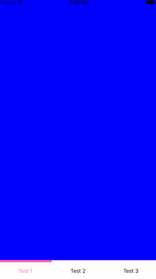

## react-native-tabbar

React-Native Tab bar with more freedom

**Note:** If you used the previous 0.1.x versions, you will need to use the new API.

### Introduction

So to make story short I didn't like react-native Tabbar base component. It is very basic and it doesn't support custom icons. Then after couple of weeks, (react-native-icons)[https://github.com/corymsmith/react-native-icons] came with a lot of new features such as Custom icons, and I loved it. It served me pretty well until my requirement changed. Now I have to support multiple layers of icons, custom image and custom view for each icon. Unfortunately, (react-native-icons)[https://github.com/corymsmith/react-native-icons] doesn't support custom image yet. So I decided to create a universal module which technically can work on both iOS and Android version of `react-native`.

### Installation

```bash
npm install react-native-tabbar
```

### Demo



### Usage

```js
// Inside component render()
<Tabbar selected={this.state.selected} onTabItemPress={name => this.setState({ selected: name })>
  <Tabbar.Item name="Tab 1">
    <Text>This is the first tab</Text>
  </Tabbar.Item>
  <Tabbar.Item name="Tab 2">
    <Text>This is the second tab</Text>
  </Tabbar.Item>
  <Tabbar.Item name="Tab 3">
    <Text>This is the third tab</Text>
  </Tabbar.Item>
</Tabbar>
```

Please refer to the [example](./example) folder for a full example.

### API

There are two components in this package.

#### Tabbar

`Tabbar` component is the main component which wraps everything and provides four props:
 
1. `selected` (`string`, **required**) - The name of the selected tab 
2. `onTabItemPress` (`func`, **required**) - A function that is invoked when a tab is pressed. Called with tab name. 
3. `tabHeight` (`number`) - The height of the tabbar. (defaults to `50`)
4. `renderTabComponent` (`func`) - A function that returns a tab element. Called with `(name, isActive)`.
   (defaults to a `View` with `Text` label)

#### Tabbar.Item

Each Item must have a `name`. So each item should pass a unique `name` to item. This name is being passed back to `onTabItemPress` callback function registered at `Tabbar`.
